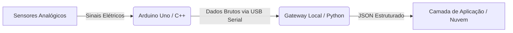

# Aula Prática: Arquitetura de Coleta e Encaminhamento de Dados IoT

## 🏗️ Fluxo de Dados da Arquitetura


---

## 💾 1. Camada de Borda: Código C++ (Arduino)
O microcontrolador coleta a telemetria do sensor, executa o tratamento inicial dos dados e despacha os valores via interface serial.

```cpp
#include <Arduino.h>

const int PINO_SENSOR = A0;      // Pino de leitura do sensor
const unsigned long INTERVALO = 1000; // Tempo de amostragem: 1 segundo
unsigned long milisegundosAnteriores = 0;

void setup() {
  Serial.begin(9600); // Inicializa a taxa de transmissão serial
  pinMode(PINO_SENSOR, INPUT);
}

void loop() {
  unsigned long milisegundosAtuais = millis();

  // Amostragem temporal sem bloquear o processamento interno (Sem usar delay)
  if (milisegundosAtuais - milisegundosAnteriores >= INTERVALO) {
    milisegundosAnteriores = milisegundosAtuais;

    int valorBruto = analogRead(PINO_SENSOR);
    
    // Transmissão direta formatada para leitura de string
    Serial.println(valorBruto); 
  }
}
```

---

## 🐍 2. Camada de Integração: Código Python (Gateway)
O script Python atua como um Middleware. Ele captura a string da porta serial, limpa os ruídos de transmissão, valida o dado e prepara o payload.

### 🛠️ Instalação da Dependência
Os alunos devem executar o comando abaixo no terminal antes de rodar o script:
```bash
pip install pyserial
```

### 💻 Script Gateway em Python
```python
import serial
import time
import json

# Configuração de hardware (Substitua pela porta correta do sistema)
# Windows: 'COM3', 'COM4' | Linux/MacOS: '/dev/ttyUSB0', '/dev/ttyACM0'
PORTA_SERIAL = 'COM3'
BAUD_RATE = 9600

try:
    # Inicialização da interface física de comunicação
    comunicacao_arduino = serial.Serial(PORTA_SERIAL, BAUD_RATE, timeout=1)
    time.sleep(2) # Delay técnico para reinicialização do bootloader do Arduino
    print(f"✅ Conectado na porta: {PORTA_SERIAL}")

    while True:
        if comunicacao_arduino.in_waiting > 0:
            # Captura a linha de bytes, decodifica em string utf-8 e limpa caracteres de escape (\r\n)
            dados_brutos = comunicacao_arduino.readline().decode('utf-8').strip()
            
            if dados_brutos:
                try:
                    valor_sensor = int(dados_brutos)
                    
                    # Estruturação em formato JSON para padronização de arquitetura IoT
                    payload_iot = {
                        "dispositivo": "Arduino_Uno_01",
                        "timestamp": int(time.time()),
                        "leitura_sensor": valor_sensor
                    }
                    
                    print(f"🚀 Payload Pronto para Envio: {json.dumps(payload_iot)}")
                    
                except ValueError:
                    print(f"⚠️ Falha de parsing: Caractere inválido recebido -> {dados_brutos}")
                    
        time.sleep(0.05) # Controle de processamento do laço de repetição

except serial.SerialException:
    print(f"❌ Erro Crítico: Interface física {PORTA_SERIAL} inacessível ou desconectada.")
except KeyboardInterrupt:
    print("\n🛑 Serviço do Gateway IoT finalizado pelo operador.")
finally:
    if 'comunicacao_arduino' in locals() and comunicacao_arduino.is_open:
        comunicacao_arduino.close()
        print("🔌 Conexão serial encerrada de forma segura.")
```

---

## 🧠 Atividade de Fixação para o Relatório Técnico
1. **Calibração de Borda (C++):** Modifique o firmware em C++ para converter a leitura analógica bruta (`0 a 1023`) em tensão equivalente (`0.0V a 5.0V`) antes do envio.
2. **Tratamento de Dados (Python):** Altere a estrutura do dicionário JSON no Python para incluir um campo booleano chamado `alerta`, que deve ser `True` sempre que o valor do sensor ultrapassar a marca limite de 700.