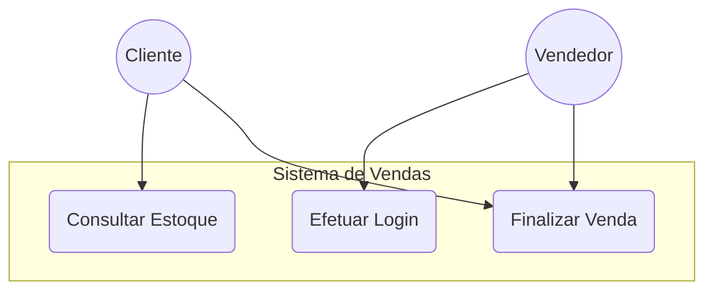

# Engenharia de Requisitos: Da Captura à Especificação Técnica

## 🎯 Objetivos da Aprendizagem
* Dominar as técnicas fundamentais de elicitação de requisitos com usuários.
* Diferenciar escopo funcional de atributos de qualidade de software.
* Modelar interações de sistemas por meio de diagramas técnicos.
* Estruturar artefatos e relatórios de especificação para o time de desenvolvimento.

---

## 👥 1. Técnicas de Elicitação de Requisitos

### 🎙️ A. Entrevistas
Processo direto de conversação com stakeholders para entender dores, fluxos de trabalho e expectativas.
* **Planejamento:** Preparar roteiros semiestruturados com perguntas abertas.
* **Foco:** Evitar termos excessivamente técnicos; focar no domínio do negócio do cliente.

### 🧠 B. Brainstorming
Sessões de cocriação e geração livre de ideias com a equipe do projeto e clientes.
* **Regra de Ouro:** Focar em quantidade de ideias na fase inicial, sem julgamentos ou filtros técnicos prematuros.
* **Resultado:** Consolidação e agrupamento de ideias em um mapa mental de escopo.

---

## ⚙️ 2. Especificação: Requisitos Funcionais (RF) vs. Não Funcionais (RNF)

* **Requisitos Funcionais (RF):** Descrevem **o que** o sistema deve fazer (comportamento, recursos, ações).
  * *Exemplo (RF01):* O sistema deve emitir um alerta na tela quando o estoque de um item atingir o limite mínimo.
* **Requisitos Não Funcionais (RNF):** Descrevem **como** o sistema deve se comportar (desempenho, segurança, qualidade).
  * *Exemplo (RNF01):* O sistema deve processar requisições de pagamento em menos de 2 segundos sob criptografia TLS 1.3.

---

## 🎨 3. Prototipagem
Validação rápida de ideias e requisitos por meio de representações visuais da interface do sistema.
* **Baixa Fidelidade:** Desenhos em papel (wireframes) para validar a disposição dos elementos e o fluxo de navegação.
* **Alta Fidelidade:** Protótipos interativos (Figma/Adobe XD) para validar a experiência de uso (UX) e design antes do código.

---

## 📊 4. Diagramas de Modelagem
Uso do padrão UML para mapear e documentar visualmente os requisitos estabelecidos.

### 👥 Diagrama de Casos de Uso (Exemplo Mermaid)

---

## 📄 5. Relatórios Técnicos
Artefatos formais que servem como contrato técnico entre o cliente, os analistas e os desenvolvedores.

### 📑 Estrutura Recomendada para Documento de Requisitos (SRS)
1. **Introdução:** Objetivo do sistema e escopo geral.
2. **Descrição Geral:** Perspectiva do produto e restrições de design.
3. **Requisitos Funcionais:** Tabela detalhada com ID, Nome, Descrição e Prioridade (Alta/Média/Baixa).
4. **Requisitos Não Funcionais:** Critérios de desempenho, segurança e portabilidade.
5. **Apêndices:** Protótipos de tela associados aos requisitos.